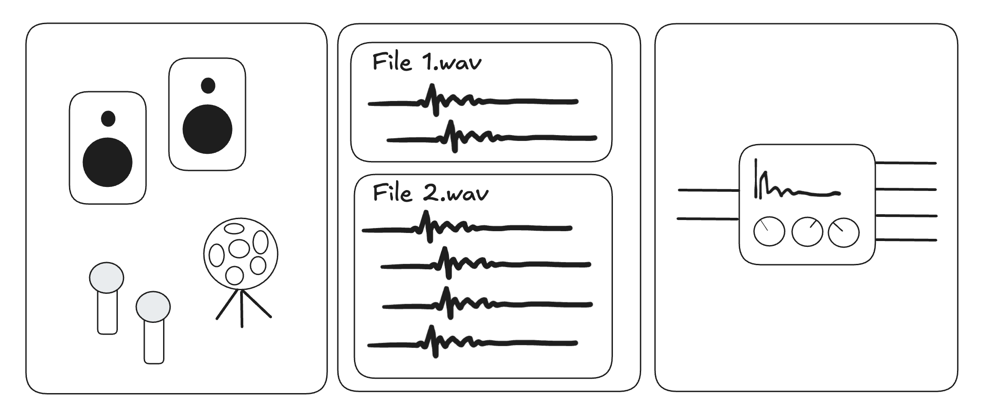
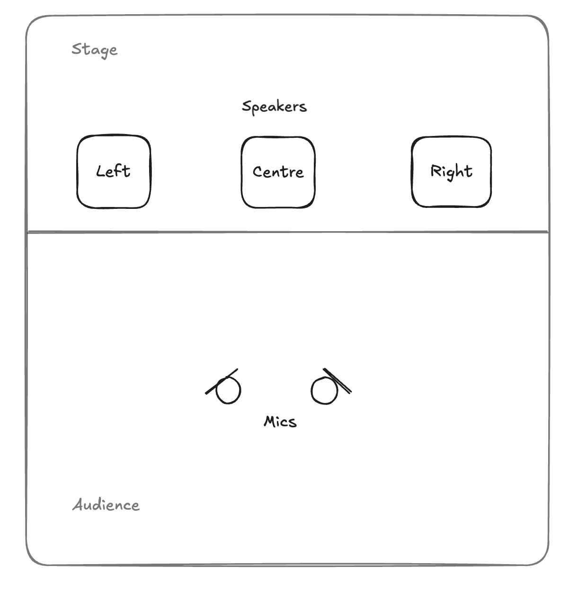
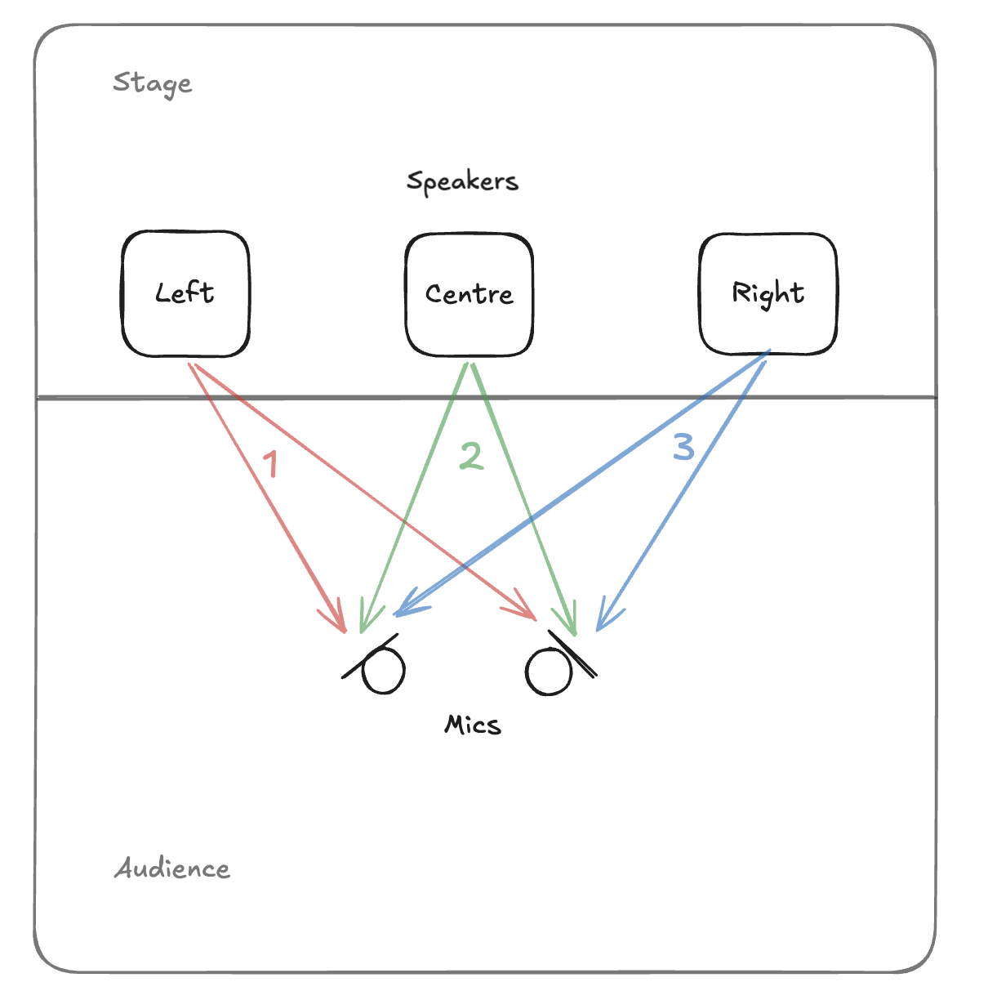
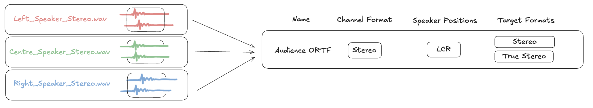

# Recording Impulse Responses

There are many ways of thinking about and recording impulse responses.
You have to consider the number of speakers and microphones to use,
the number of .wav files and number of channels in each file,
and what your input and output channel configuration will be when
it's time to convolve the IR.
This guide aims to explain the naming convention we use for Zones to help format your IR's before you upload.

The diagram below shows a typical layout for recording IR's in a concert hall.
We use three speaker positions: left, centre and right.

A sine-sweep coming from each speaker gets recorded into a pair of microphones.
After de-convolving, We have three .wav files
(each with two channels) which we can label: L_speaker_stereo, C_speaker_stereo, R_speaker_stereo.
Notice that we call each file 'stereo' in reference to the number of mics, not the
number of speaker positions.

Although we now have three files, these form one IR in Zones, because each speaker
position shares the same mic position. However, we can of course use this IR in
a few different ways, such as stereo or true stereo. It may be more helpful to think
of them as one position, but with width so the input can be mono or stereo.

If you are familiar with 'true stereo' IRs, you may expect that we would have to upload
a four channel .wav, but in our case we have separate files as they were recorded, and
let Zones rearrange as necessary inside the plugin.

We can add more IR's to the same 'Zone' by changing our setup. For example:

- Moving the speaker positions to the back of the stage
- Changing from a sine-sweep method to a direct impulse recording
- Moving the mics to a different position in the audience
- Using a different mic array, such as an ambisonics mic

So far we've described IR's in a concert hall setting, but the same process can
be used for other IR recordings where there isn't a physical space to record or
actual speakers. For example, sampling a digital reverb or guitar amp. If the
input to the system is mono, it will be labelled as a 'centre speaker position' (C).
If the input is stereo, 'left and right speaker positions' (LR).

If a mono -> stereo or stereo -> stereo instance of Zones is loaded in your DAW, you
can still use your IR if the inputs don't match your recording setup, as Zones will
do the appropriate summing or doubling of the input signal as necessary.

