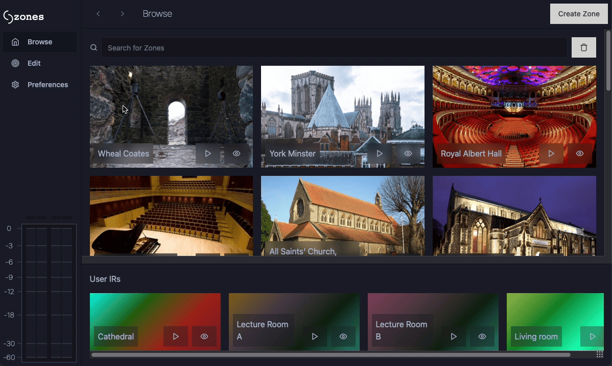
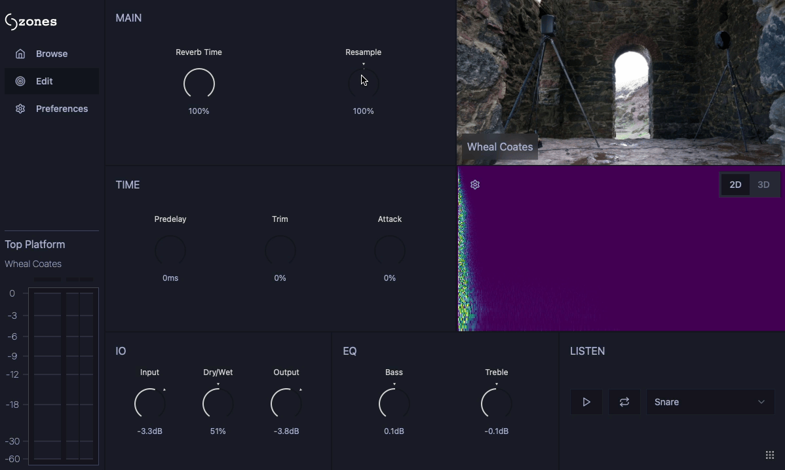

# Web

# Introduction (home page)

Zones is a library of impulse responses, available to use and edit directly in your
DAW. The library is built on user uploaded recordings and are free to access by downloading
our plugin.

# Installation

Please note: This plugin is currently in development, so we ask that you try it out with caution.
There may be bugs, crashes and unexpected behaviour whilst we work towards a stable release.

The latest version can be downloaded [here.](https://github.com/zones-convolution/zones_client/releases)

If you experience any trouble downloading the plugin, please [get in touch.](#Contact)

# About

## Mission Statement

Zones was created as an easy way to share impulse response's (IR's). Typically, good quality
libraries and plugins are expensive and finding free IR's is difficult.

Our aim is to simplify the process so that not only is there a range of reverbs neatly collected, but
using them practically in the DAW is easy. This simplifies the workflow and makes
using IR's more accessible as anyone with the plugin installed can access all zones without leaving
the DAW.

Zones has also been designed to be flexible in a number or use cases, such as for a pop mixing engineer
to add nice sounding reverb to a different instruments, a classical engineer who wants to the sound
of their favourite concert hall or a post-production mixer who wants to add realistic room reverb after
ADR. Impulse responses can also be used beyond reverb to mix sounds together creatively.

Zones has been developed with zero budget and is completely free for users.
Legal information can be found [here.](#legal-stuff)

## Features

### Browsing the Library

Exploring Zones is easy using the browse tab. You can see highlighted zones, ones you've used before or search
the whole library.


Trying one out is easy as with one click we'll automatically pick the most appropriate IR and download it. We also
save every IR you use to speed up loading time.


For a more in depth look, select the card to see all the IR's available, more images and details about the recording.



You can also create and test out your own IR's locally.


### Using the editor

Using the editor you can make changes to the ir, with the 2D and 3D visualiser reflecting your changes allowing you
to make detailed adjustments to the sound. We've used our own convolution algorithm to work efficiently in the plugin.
It also handles smooth cross-fading when making adjustments to the IR or fading efficiently to
reduce overloading when the IR is extremely long.



### Uploading Your Own Recordings

Using this website you can easily upload your own impulse responses to share your sounds with the rest of the world.
On your account page you can see your contributions and publish new Zones easily, with images, descriptions and
metadata.


## Contact

Feel free to get in touch regarding anything such as questions about uploading recordings or
contributing to the plugin.

**Leon Paterson-Stephens** - leon@leonps.com

**Micah Strange** - micahstrange16@gmail.com

## Useful Links

### Upload guide

### Manual

### Zones client

### Zones convolver

### Legal Stuff

============================================================================

# Challenges in designing a convolution reverb plugin

## organising channel layouts

### Why formats matter for IR's

Making a plugin flexible for different channel configurations is more complicated
than simply iterating up to num_channels whenever you do any processing.
In the context of convolution plugins, there is a large range of possible
variations and edge cases to account for.
Many plugins are restricted to mono-mono, mono-stereo and stereo-stereo.

Mono-stereo is an especially important with impulse responses as they are
commonly captured with a single speaker and stereo pair of mics, so it
makes sense that a plugin would be mono-stereo as the physical recording of
an ir is a mono sound source given spatial width by the room its played in.

Furthermore, an essential feature of nice-sounding stereo convolution is using
IR's capable of "true stereo". In this case we now have to deal with not only
inputs and outputs of different sizes but also IR's, making the convolution
engine more complicated.

The world of impulse responses and field recording aren't just limited to stereo mic
techniques. spatial audio, particularly first order ambisonics are common in
recording IR's for ambience. Furthermore, the role of reverb in post production
is increasingly about placing sources in a surround mix. It is often the
reverb itself that gives a mono source spatial information, or can be used
to convert mismatching speaker counts (such as by spreading reverb into empty speakers).

All the different use cases of IR's were important to consider when designing
the plugin. To target post-production users, a large range of surround formats
should be supported, from 5.1 to 9.1.2 and all the small variations accounted for.
To appeal to the general mixing engineer, mono-mono, mono-stereo and stereo-stereo
should be fully supported to place instruments in a room in a realistic and
nice sounding way.
However, to support creative use cases, irs should be able to be converted
to whatever channel layout the plugin is running, wherever is realistic.
In particular, ambisonics should be loadable to stereo. This approach also
has the benefit of allowing users to access as many zones and IR's as possible,
without them thinking about formats and conversions.

This doesn't mean that all these configurations are possible or are planned to
be included, but that the architecture allows us to add these configurations
where possible.

### Our Design

From JUCE we get the channel layout of the plugin, which we have decided ourselves
is compatible through the ```isBusesLayoutSupported()``` function. This is converted
into a vector of ```TargetFormat``` enums, which represent the possible IR formats that
can be passed into the convolution engine.

This vector is passed to the UI, so that the browse tab knows which IR's to display to
the user. It is important that this vector is not the exhaustive list of compatible formats,
but the only formats that don't need to be converted. For example, in stereo-stereo
configuration, the valid target formats are ```Stereo```, ```TrueStereo```. A mono IR
will have to be duplicated to stereo.

A ```ChannelFormat``` is a slightly different enum, which relates to the format of a buffer.
True stereo is not a channel format, but stereo is included in both. However, it is not
just related to the number of channels as FOA and quadraphonic are both channel formats
with 4 channels.

When a user selects an IR, it is sent to ```IRController``` as an ```IrSelection```. This
includes the metadata for the Zone, the selected IR and the chosen target format. This is passed
to a formatter depending on its channel format, where the IR is loaded from disk and returned
as a single buffer.

This buffer is then passed to ```IREngine```, along with the target format. This allows
the potential for adding processors unique to the target format, such as a true stereo
pan control.

a final check between the current bus layout and the target format in ```IrGraphState``` is
performed. This may seem excessive but prevents against the possibility of the bus layout
changing whilst an IR is being processed by IR graph, or a potential case where a preset
is loading an IR in a different configuration.

In summary, our approach gives us flexibility to add and modify channel configurations as
new formats can be added to the channel format and target format enums. This makes
adding higher spatial formats such as 5.1 and HOA less time-consuming in the future. In addition, converting
formats can be added at any point to the IR formatters to allow new combinations such
as loading a stereo IR in a 5.1 configuration.

## swapping in new irs / modifying large irs quickly...